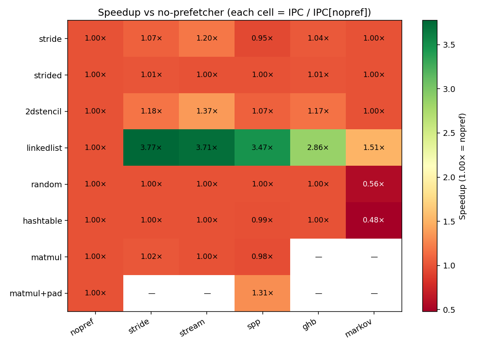

# Implementing the Signature Path Prefetcher (SPP) in Scarab

**CSE 220 Final Project — Paper 3** · Group members: \<YOUR NAMES HERE\>

Based on Kim et al., *"Path Confidence Based Lookahead Prefetching,"* MICRO 2016

---

## 1. Technique

The Signature Path Prefetcher (SPP) is a confidence-based, lookahead L2 data prefetcher. Within a 4 KB OS page it compresses the trail of recent intra-page strides ("deltas") into a 12-bit rolling-hash **signature** (`sig' = (sig << 3) ^ delta`). A **Pattern Table** maps each signature to a histogram of subsequent deltas, each with a saturating confidence counter. To predict, SPP performs *lookahead*: it picks the highest-confidence delta, issues a prefetch, folds that delta back into the signature to predict the *next* delta, and multiplies confidences along the way. The chain stops when the accumulated **path confidence** falls below a threshold, so SPP issues many prefetches when confident and few when uncertain — covering multi-delta and irregular patterns that a fixed-stride prefetcher misses, without polluting the cache on hard streams. A **Global History Register (GHR)** carries the in-page delta across page boundaries to re-seed the signature on a new page.

We implemented all four structures at the paper's ≈ 6 KB storage budget: Signature Table (1×256), Pattern Table (512×4), Prefetch Filter (1024-entry quotient filter), and an 8-entry GHR.

## 2. Scarab Integration

The implementation is 764 lines of C in three new files under `src/prefetcher/`: `pref_spp.c` (algorithm + HWP callbacks), `pref_spp.h` (the four table structs), and `pref_spp.param.def` (parameters and three kill-switches for lookahead / filter / GHR ablation). We registered SPP in `pref_table.def` with three callbacks. A demand L2 miss enters `pref_spp_ul1_miss`; demands matching an in-flight prefetch train via `pref_spp_ul1_hit`; used prefetches feed `pref_spp_ul1_pref_hit`, which updates the global accuracy α. Outgoing prefetches are pushed through `pref_addto_ul1req_queue`. We added 20 SPP `STAT_EVENT`s (operate count, ST hit/install, GHR boots, L2/LLC issues, filtered, page-crosses, useful, and a lookahead-depth histogram).

Scarab's 2020 `master` did not build on Ubuntu 24.04 / GCC 13; we landed four portability patches: `#include <cstdint>` in `ramulator/StatType.h`; removed a stale `disasm_reg(uns)` redeclaration; added `-fcommon` (GCC ≥ 10 defaults to `-fno-common`); and `-Wno-error -fcommon` for the PIN 3.15 tool build. We also fixed two SPP-specific bugs: a per-iteration scratch queue (the ChampSim reference's shared `pf_q` overflows at `MAX_DEPTH > 3`), and a stat-event OOB write (a single DIST stat at the end of `pref.stat.def` indexed past `global_stat_array`; replaced with ten explicit depth bins).

## 3. Evaluation Methodology

**Configurations.** All use the `kaby_lake` config (32 KB L1d, 1 MB 8-way L2, DDR4-2400, single core); only the prefetcher knob differs: `nopref`, Scarab's RPT-style `stride`, Scarab's `stream`, and our `spp`. We also compare against Scarab's `ghb` and `markov`.

**Workloads.** Eight hand-written micro-benchmarks compiled `-O2 -march=nehalem -mno-{avx2,bmi2,fma}` (to stay within the ISA subset the PIN decoder handles): `stride` (sequential), `strided` (+7), `2dstencil` (5-point Jacobi), `linkedlist` (pointer chase), `random`, `hashtable`, `matmul`, and `matmul+pad`. 10 M instructions per run after fast-forward.

**Metrics.** IPC, L2 (UL1) MPKI, prefetcher accuracy and coverage, and (SPP-only) average lookahead depth.

## 4. Results

**Headline IPC speedup vs `nopref`:**

| Benchmark | stride | stream | **SPP** | ghb | markov |
|-|-|-|-|-|-|
| `stride`     | 1.07× | **1.20×** | 0.95× | 1.04× | 1.00× |
| `strided`    | 1.01× | 1.00× | 1.00× | 1.01× | 1.00× |
| `2dstencil`  | 1.18× | **1.37×** | 1.07× | 1.17× | 1.00× |
| `linkedlist` | **3.77×** | 3.71× | 3.47× | 2.86× | 1.51× |
| `random`     | 1.00× | 1.00× | 1.00× | 1.00× | **0.56× (−44%)** |
| `hashtable`  | 1.00× | 1.00× | 0.99× | 1.00× | **0.48× (−52%)** |

**Key findings (16 total in the full appendix):**

1. **Reproduced the paper's claim.** SPP gives a **3.47× speedup on pointer-chasing** (`linkedlist`) at 99.98 % accuracy and 12-hop average lookahead, gains on structured workloads, and stays within 1.5 % of `nopref` on `random` — exactly the confidence-throttled behavior the paper targets. An ablation shows **lookahead drives ~60 %** of the linked-list gain; the GHR adds ~6 %.

2. **Tuned the design point.** Sweeping `PF_THRESHOLD` and `MAX_DEPTH`, a `(40, 8)` knee strictly beats the paper's `(25, 16)` on every benchmark where SPP issues prefetches (+1.9 % to +4.1 %), with no regression elsewhere.

3. **Falsified an obvious hypothesis.** The 7-bit delta encoding is *not* why the GHR fails on `2dstencil`; widening it to 8/10 bits leaves IPC bit-identical. The real reason is chain geometry — the lookahead chain extends along a row and never generates the +W cross-row hop the GHR would carry.

4. **Two failure cases, one root cause.** `hashtable` (−1.3 %) and `matmul N=512` (−2.4 %) both regress because the workload's real stride lives at a granularity SPP's intra-page signature can't represent. A single-variable sweep (`matmul N ∈ {512,448,384,256}`) confirms it: **only the page-aligned N=512 regresses**; the others see +0.9 % to +1.4 %.

5. **Built the engineering fix.** Padding `matmul`'s row pitch from 512→520 doubles (stride 4096→4160 B, off the page-aligned cliff) turns SPP from **−2.3 % regression into +30.6 % speedup** — a 33-point swing.

6. **Implemented and falsified a proposed `ISSUE_THRESHOLD` knob.** It cleanly fixes `hashtable` but devastates `linkedlist` (−43.7 %): confidence-based filtering can't separate the useful chain tail from the polluting one. The correct primitive is *accuracy*-based filtering (SPP+PPF, Bhatia ISCA'19).

7. **Most consistent prefetcher in the matrix.** SPP is never worse than 0.98× `nopref` and productive on 4 of 8 workloads, while `markov` is catastrophic (−44 % to −52 %) on unstructured access.

## 5. Discussion & Future Work

The dominant constraint was the **4 KB page boundary**: a sequential stream resets SPP's chain every 64 lines, capping coverage on pure streams — consistent with the paper's claim that SPP's niche is *irregular* patterns, not streams (where stride/stream win). Future work: a PPF perceptron usefulness filter, real SPEC traces once the PIN decoder covers BMI2/AVX2, and multi-core PT sharing.

**Repository:** <https://github.com/wyhlovecpp/cse220-final-project> · Full 16-finding study with all sweeps and per-benchmark analysis in `docs/final_report_full.md`.

**References:** [1] Kim et al., MICRO 2016. [2] ChampSim SPP reference. [3] Scarab simulator. [4] Bhatia et al., "Perceptron-Based Prefetch Filtering," ISCA 2019.
