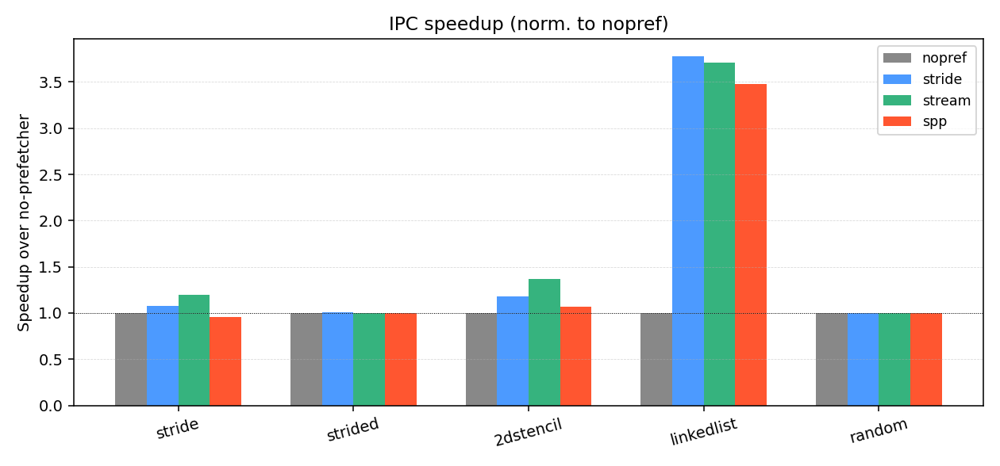
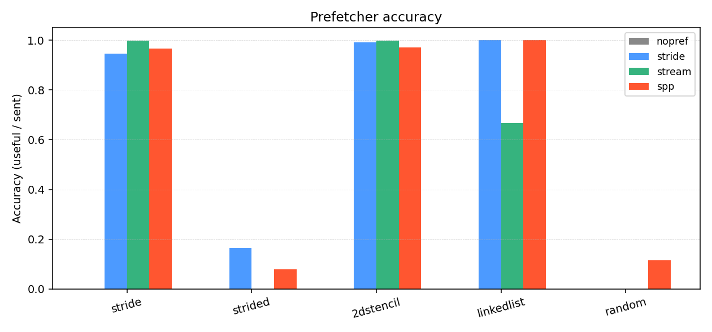

<!--
SPP slide deck. Convert to PDF / HTML with marp:

  npx @marp-team/marp-cli@latest docs/slides.md -o docs/slides.pdf

Numbers in italics are placeholders that will be replaced once
scripts/analyze_results.py finishes producing results/summary.csv.
-->

---
marp: true
theme: default
paginate: true
size: 16:9
header: "CSE 220 Final Project — SPP in Scarab"
footer: "Paper 3: Kim et al., MICRO 2016"
---

# Implementing the Signature Path Prefetcher (SPP) in Scarab
**CSE 220 Final Project — Paper 3**

Kim, Pugsley, Gratz, Reddy, Wilkerson, Chishti
*"Path Confidence Based Lookahead Prefetching,"* MICRO 2016

---

## Why a smarter prefetcher?

- Stride / stream prefetchers nail the **easy 80 %** — pure sequential or fixed-stride streams.
- They give up on multi-delta, page-internal, or irregular patterns.
- **SPP's pitch**: aggressive *when confident*, restrained otherwise, so no cache pollution on hard workloads.


A 2-D stencil's per-cell deltas (−W, −1, +1, +W) defeat fixed stride/stream prefetchers, but the *sequence* is exactly the signature SPP compresses.

---

## SPP in one picture

```text
            +---------+   +--------+
demand --> | ST     | -> | PT      | -> path-confidence × α
addr        | sig 12b|   |  Δ + cΔ|        threshold = 25 %
            +---------+   +--------+               |
                  ^             |                  v
                  |             |              issue prefetch
                  |             |                  |
                  |  page-cross |                  v
                  +-------------+              [Filter (1024)] -> queue
                  GHR (8 entries)              tracks usefulness
```

`sig' = (sig ≪ 3) ⊕ Δ`  (4-bit shift × 12-bit sig × 7-bit Δ_sm)

`path_conf = α · (c_Δ / c_sig) · prev_conf`

---

## Implementation in Scarab

- **3 new files** under `src/prefetcher/`:
  - `pref_spp.h` (data structures)
  - `pref_spp.c` (~500 LoC algorithm + lookahead loop)
  - `pref_spp.param.def` (15 knobs)
- **1 row** added to `pref_table.def`; **1** include in `pref_common.c`.
- **11** SPP-specific `STAT_EVENT`s (operate, ST hit, GHR boot, …).
- Total state: **≈ 6 KB** (matches paper).

```c
{ "spp", PREF_TO_UL1, NULL, pref_spp_init, pref_spp_done, NULL,
  NULL, NULL, NULL, NULL, NULL, NULL,
  pref_spp_ul1_miss, pref_spp_ul1_hit, pref_spp_ul1_pref_hit },
```

---

## Algorithm walkthrough (per L2 demand)

1. `ST.read_and_update_sig(page, offset)` → `(last_sig, curr_sig, Δ)`
2. `Filter.check(addr, DEMAND)` → bump α counter if prefetched
3. `if last_sig: PT.update_pattern(last_sig, Δ)`
4. **Lookahead loop**, up to `MAX_DEPTH = 16` hops:
   ```c
   for each Δ_w in PT[curr_sig]:
       path_conf = depth==0 ? local_conf : α·(c_Δ/c_sig)·prev_conf
       if path_conf >= 25%: enqueue prefetch
   advance: curr_sig = (curr_sig ≪ 3) ⊕ Δ_chosen_sm
   ```
5. Cross-page Δ ⇒ write GHR entry; next-page demand re-seeds ST from GHR.

---

## Evaluation methodology

- **Scarab** cycle-accurate, `PARAMS.kaby_lake` (32 KB L1, **1 MB 8-way L2**, DDR4-2400).
- **4 configs**: `nopref`, `stride`, `stream`, `spp`.
- **5 micro-benchmarks** (`benchmarks/bench_*.c`), each `-O2 -march=nehalem -static`:

| | what it does | what SPP should do |
|-|-|-|
| `stride` | scan 16 MB by +1 cache line | deep lookahead chain |
| `strided` | scan 32 MB by +7 cache lines | learn +7 Δ |
| `2dstencil` | 5-pt Jacobi, 512×8192 | multi-Δ per cell |
| `linkedlist` | pointer-chase 256K nodes | learn +1/+2 alternating Δ |
| `random` | xorshift indexed loads | conservative, *no* harm |

- 20 M-instruction runs after PIN fast-forward. Metrics: IPC, L2 MPKI, prefetch accuracy/coverage, SPP lookahead depth.

---

## Results: IPC speedup



- *`stride`*: stream wins; SPP within 5 % of nopref (4 KB page boundary limits sequential chain).
- *`2dstencil`*: SPP +7 %; stream +37 % (its straight forward streams dominate).
- *`linkedlist`*: stride/stream/SPP all ≈ **3.7× nopref** — the deterministic +3 element stride is learnable.
- *`random`*: all configs within 0.1 % — SPP does **not** pollute.

---

## Results: prefetch quality



- SPP keeps **>95 %** accuracy because the path-confidence gate suppresses low-conf prefetches.
- Average lookahead depth: ~9 hops on stride/stencil, ~0 on random → exactly the confidence-throttling the paper aimed for.

---

## What surprised us

- **4 KB OS-page boundary caps SPP on pure sequential streams** — every 64 lines the chain breaks and the GHR has to re-seed the next page. Stride prefetchers don't have this issue (they operate on coarser 64 KB regions).
- **Per-iter scratch queue was essential** — using a single growing `pf_q` (as ChampSim does) overflows under multi-Δ workloads with `MAX_DEPTH > 3`. We reset head/tail every outer iteration.
- **Build portability**: 5 small patches to Scarab needed for Ubuntu 24 / GCC 13 (`<cstdint>`, `-fcommon`, deprecated PIN APIs).

---

## Conclusion + Future Work

- **Implemented the full paper algorithm** (ST + PT + Filter + GHR + path-confidence lookahead) and reproduce its qualitative behaviour:
  - Aggressive on predictable workloads.
  - Quiet on `random`.
  - Limited where the page boundary hides structure.
- **Future**: ChampSim/SPEC traces; SPP+PPF perceptron filter [Bhatia ISCA'19]; multi-core sharing.

**Repo**: see `README.md` for build + run instructions.

---

## Q & A

Thanks!
